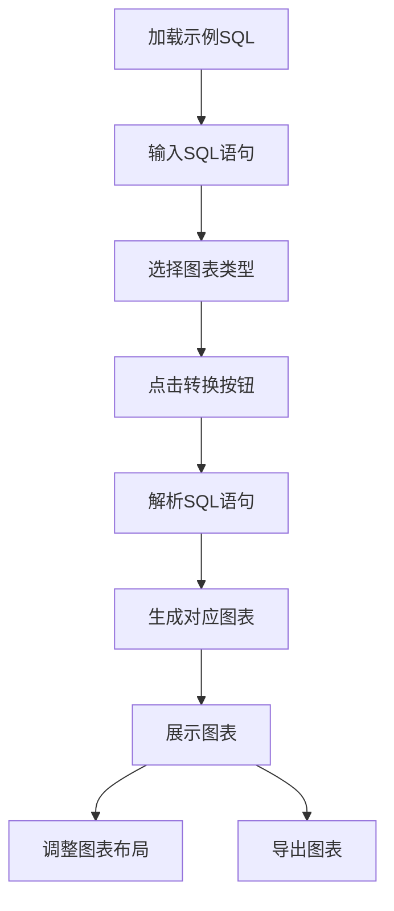

## 1. 产品概述
SQL转ER图在线工具是一个将SQL语句转换为可视化ER图的网页应用，帮助用户更直观地理解数据库结构。
- 主要功能是解析SQL建表语句，自动生成对应的实体关系图，支持多种数据库语法。
- 目标用户为数据库开发者、后端工程师和数据分析师，提高数据库设计和理解效率。

## 2. 核心功能

### 2.1 用户角色
| 角色 | 注册方式 | 核心权限 |
|------|----------|----------|
| 普通用户 | 无需注册 | 可使用所有转换功能 |

### 2.2 功能模块
1. **主页面**：SQL输入区域、图表展示区域、工具栏、导出功能

### 2.3 页面详情
| 页面名称 | 模块名称 | 功能描述 |
|----------|----------|----------|
| 主页面 | SQL输入区域 | 提供文本框用于输入SQL建表语句，支持语法高亮，提供示例SQL |
| 主页面 | 图表展示区域 | 展示生成的各种图表，包括ER图、用例图、功能模块图、流程图、时序图、数据流图，支持拖拽调整位置，缩放功能 |
| 主页面 | 工具栏 | 提供转换按钮、清空按钮、图表类型选择、数据库类型选择 |
| 主页面 | 导出功能 | 支持导出图表为图片、PDF等格式 |
| 主页面 | 示例库 | 提供常用数据库结构示例，点击即可加载 |

## 3. 核心流程
用户在SQL输入区域输入建表语句，选择图表类型，点击转换按钮后，系统解析SQL并在图表展示区域生成对应的可视化图表。用户可以调整图表布局，导出为图片或PDF，或加载示例SQL进行测试。

## 4. 用户界面设计
### 4.1 设计风格
- 主色调：蓝色系 (#1E88E5) 和白色 (#FFFFFF)
- 辅助色：浅灰色 (#F5F5F5)，深灰色 (#424242)
- 按钮风格：圆角矩形，有轻微阴影
- 字体：系统默认无衬线字体，代码使用等宽字体
- 布局风格：左右分栏布局，左侧为SQL输入区，右侧为图表展示区
- 图标风格：简约线条图标

### 4.2 页面设计概览
| 页面名称 | 模块名称 | UI元素 |
|----------|----------|--------|
| 主页面 | SQL输入区域 | 文本框，语法高亮，滚动条，行数显示，右上角有清空按钮 |
| 主页面 | 图表展示区域 | 白色背景，根据图表类型显示不同样式，支持缩放和拖拽 |
| 主页面 | 工具栏 | 转换按钮（蓝色），图表类型选择下拉框，数据库类型选择下拉框 |
| 主页面 | 导出功能 | 导出按钮，支持选择导出格式（PNG、PDF） |
| 主页面 | 示例库 | 侧边栏或下拉菜单，包含多个示例SQL选项 |

### 4.3 响应式设计
- 桌面优先设计，在小屏幕设备上自动调整为上下布局
- 支持触摸操作，可在移动设备上进行基本操作
- 最小支持宽度：768px

### 4.4 3D场景指导
无3D场景需求