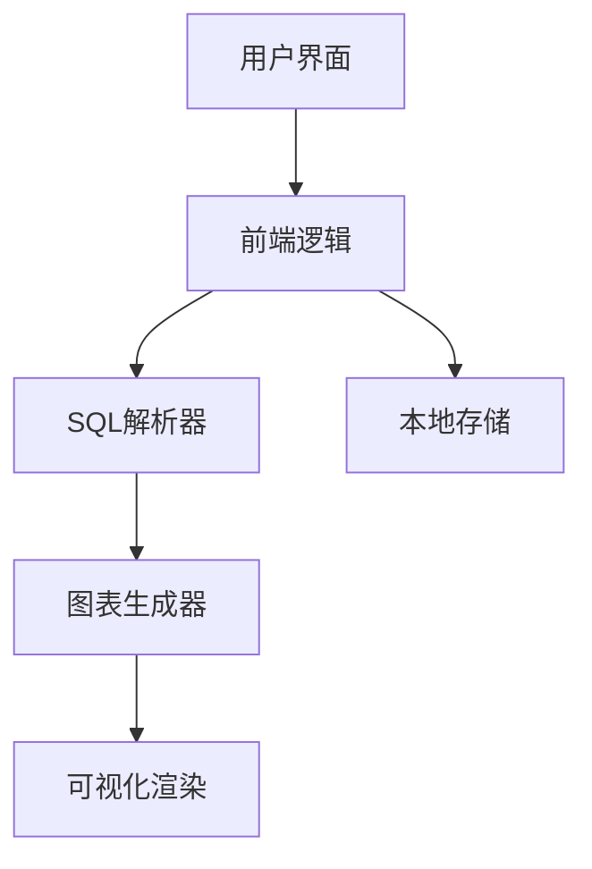

## 1. 架构设计


## 2. 技术描述
- 前端：React@18 + TypeScript + Tailwind CSS@3 + Vite
- 初始化工具：Vite
- 后端：无（纯前端实现）
- 数据库：无（使用浏览器本地存储）

## 3. 路由定义
| 路由 | 用途 |
|------|------|
| / | 主页面，包含SQL输入和图表展示 |

## 4. 技术栈详细说明
- **React**：用于构建用户界面，管理组件状态
- **TypeScript**：提供类型安全，减少运行时错误
- **Tailwind CSS**：用于快速构建响应式界面
- **Vite**：提供快速的开发和构建体验
- **sql-parser**：用于解析SQL语句
- **d3.js**：用于绘制和交互各种图表
- **mermaid.js**：用于生成流程图、时序图、用例图等
- **highlight.js**：用于SQL语法高亮
- **html2canvas**：用于导出图表为图片
- **jspdf**：用于导出图表为PDF

## 5. 核心模块设计
### 5.1 SQL解析模块
- 功能：解析SQL建表语句，提取表结构、字段、外键关系
- 支持的SQL语法：MySQL、PostgreSQL、SQLite
- 输出：结构化的表数据和关系数据

### 5.2 图表生成模块
- 功能：根据解析结果生成各种图表数据结构
- 支持的图表类型：
  - ER图：实体关系图，展示表结构和关系
  - 用例图：展示系统功能和用户交互
  - 功能模块图：展示系统功能模块划分
  - 流程图：展示业务流程
  - 时序图：展示系统组件交互时序
  - 数据流图：展示数据流动过程
- 布局算法：使用力导向图布局和层次布局

### 5.3 交互模块
- 功能：支持拖拽调整图表元素位置，缩放图表，点击元素查看详情
- 实现：使用d3.js的拖拽和缩放功能

### 5.4 导出模块
- 功能：将图表导出为PNG图片、PDF等格式
- 实现：使用html2canvas库和jspdf库

## 6. 数据结构设计
### 6.1 表结构数据
```typescript
interface Table {
  name: string;
  columns: Column[];
  primaryKeys: string[];
}

interface Column {
  name: string;
  type: string;
  nullable: boolean;
  defaultValue?: string;
  comment?: string;
}

interface Relationship {
  sourceTable: string;
  targetTable: string;
  sourceColumns: string[];
  targetColumns: string[];
  type: 'one-to-one' | 'one-to-many' | 'many-to-many';
}
```

### 6.2 应用状态
```typescript
interface AppState {
  sql: string;
  tables: Table[];
  relationships: Relationship[];
  databaseType: 'mysql' | 'postgresql' | 'sqlite';
  chartType: 'er' | 'use-case' | 'function' | 'flow' | 'sequence' | 'data-flow';
  isParsing: boolean;
  error: string | null;
}
```

## 7. 性能优化
- 使用Web Worker进行SQL解析，避免阻塞主线程
- 对于大型ER图，使用虚拟滚动和按需渲染
- 缓存解析结果，避免重复解析相同的SQL

## 8. 浏览器兼容性
- 支持现代浏览器：Chrome、Firefox、Safari、Edge
- 最低支持：Chrome 60+，Firefox 55+，Safari 12+，Edge 79+