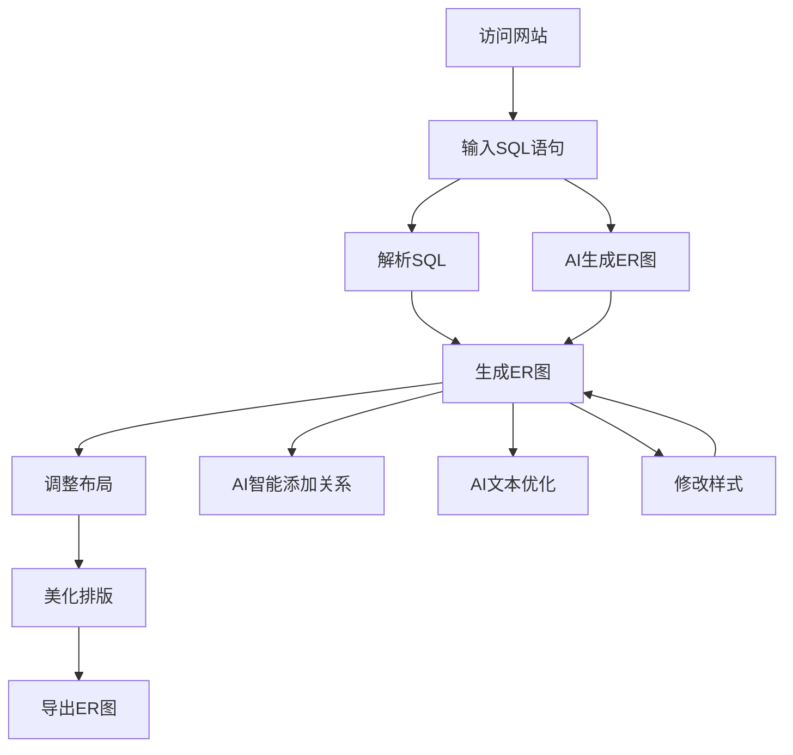

## 1. 产品概述
SQL转ER图在线生成工具是一款强大的数据库可视化工具，支持将SQL建表语句转换为专业的数据库ER图。
- 主要解决数据库设计可视化的问题，帮助开发者快速理解和展示数据库结构，提供在线绘制、AI辅助生成、智能排版布局功能
- 目标用户为数据库开发者、软件工程师和数据分析师，市场价值在于提高开发效率和团队沟通

## 2. 核心功能

### 2.1 用户角色
| 角色 | 注册方式 | 核心权限 |
|------|---------------------|------------------|
| 普通用户 | 无需注册 | 使用所有基本功能，包括SQL解析、ER图生成、导出等 |

### 2.2 功能模块
1. **主页面**：SQL输入区、ER图预览区、功能操作区、导航栏
2. **工具模块**：AI生成ER图、样式设置、导出功能

### 2.3 页面详情
| 页面名称 | 模块名称 | 功能描述 |
|-----------|-------------|---------------------|
| 主页面 | SQL输入区 | 支持粘贴SQL建表语句、上传SQL文件、清空输入、AI优化SQL |
| 主页面 | ER图预览区 | 实时显示生成的ER图，支持拖拽节点、缩放画布、双击文本可编辑、开启自动排版 |
| 主页面 | 功能操作区 | 包含解析SQL、手动输入、AI智能添加关系、美化排版、隐藏属性、智能显示属性等按钮 |
| 主页面 | 导航栏 | 包含logo、功能切换、博客链接等 |
| 工具模块 | AI生成ER图 | 根据用户输入的中文需求，AI自动生成ER图 |
| 工具模块 | 样式设置 | 自定义节点颜色、大小、布局、背景颜色、字体设置、连接线颜色、布局紧凑度等 |
| 工具模块 | 导出功能 | 支持导出PNG、SVG、JPEG、Drawio等格式 |
| 工具模块 | AI智能添加关系 | 为没有外键的SQL自动添加表关系 |
| 工具模块 | AI文本优化 | 修复不规范命名，优化SQL语句 |

## 3. 核心流程
用户使用流程：
1. 用户访问网站，在SQL输入区粘贴SQL建表语句或上传SQL文件
2. 点击解析按钮，系统分析SQL语句并生成ER图
3. 用户可以在ER图预览区调整节点位置、编辑文本
4. 使用功能操作区的按钮进行美化排版、AI智能添加关系等操作
5. 点击导出按钮，选择格式导出ER图
6. 或使用AI生成ER图功能，输入中文需求生成ER图

## 4. 用户界面设计
### 4.1 设计风格
- 主色调：蓝色系(#1E40AF)和白色(#FFFFFF)，辅助色：浅灰色(#F3F4F6)
- 按钮样式：圆角矩形，有轻微的阴影效果
- 字体：系统默认字体，标题使用16-20px，正文使用14px
- 布局风格：卡片式布局，顶部导航栏，左侧SQL输入区，右侧ER图预览区，底部功能操作区
- 图标风格：简约线条图标，主要使用lucide-react库

### 4.2 页面设计概览
| 页面名称 | 模块名称 | UI元素 |
|-----------|-------------|-------------|
| 主页面 | SQL输入区 | 多行文本框，支持语法高亮，右上角有上传和清空按钮 |
| 主页面 | ER图预览区 | 白色背景画布，支持鼠标拖拽和滚轮缩放，节点使用不同颜色区分，支持双击编辑 |
| 主页面 | 功能操作区 | 水平排列的按钮组，每个按钮有图标和文字说明，包括解析、手动输入、AI添加关系、美化排版等 |
| 主页面 | 导航栏 | 左侧logo，右侧功能按钮和博客链接 |
| 工具模块 | AI生成ER图 | 文本输入框，生成按钮，加载动画 |
| 工具模块 | 样式设置 | 表单控件，包括颜色选择器、滑块、复选框等，实时预览效果 |
| 工具模块 | 导出功能 | 下拉选择框选择格式，导出按钮，进度提示 |

### 4.3 响应式设计
- 采用桌面优先设计，同时支持平板和移动设备
- 在小屏幕设备上，布局会自动调整为垂直排列
- 触摸设备优化：增大点击区域，支持触摸手势操作

### 4.4 3D场景指导
- 无3D场景需求
