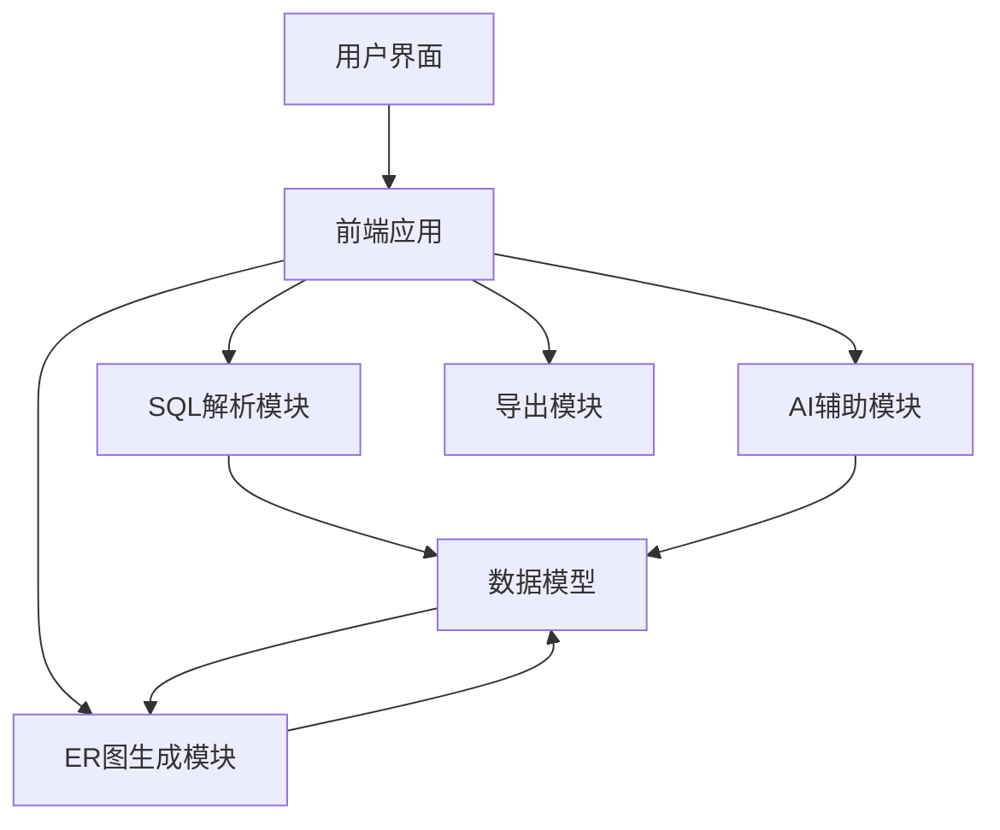
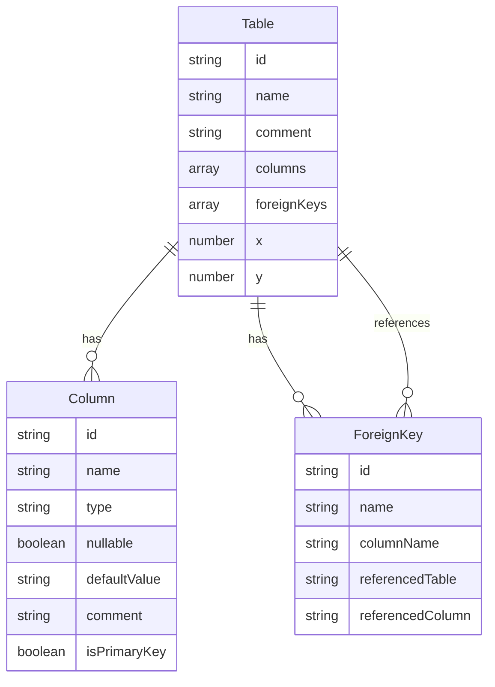

## 1. 架构设计


## 2. 技术描述
- 前端：React@18 + TypeScript + Tailwind CSS@3 + Vite
- 初始化工具：vite-init
- 后端：无（纯前端实现）
- 数据库：无（使用内存存储）
- 第三方库：
  - lucide-react（图标库）
  - react-syntax-highlighter（SQL语法高亮）
  - d3.js（ER图绘制和交互）
  - html2canvas（导出图片）
  - file-saver（文件下载）

## 3. 路由定义
| 路由 | 用途 |
|-------|---------|
| / | 主页面，包含SQL输入和ER图预览 |
| /tools | 工具页面，包含AI生成和样式设置 |

## 4. API定义
- 无后端API，所有功能在前端实现

## 5. 服务器架构图
- 无服务器架构，纯前端应用

## 6. 数据模型
### 6.1 数据模型定义


### 6.2 数据定义语言
- 无数据库表定义，使用TypeScript接口定义数据结构

```typescript
interface Column {
  id: string;
  name: string;
  type: string;
  nullable: boolean;
  defaultValue?: string;
  comment?: string;
  isPrimaryKey: boolean;
}

interface ForeignKey {
  id: string;
  name: string;
  columnName: string;
  referencedTable: string;
  referencedColumn: string;
}

interface Table {
  id: string;
  name: string;
  comment?: string;
  columns: Column[];
  foreignKeys: ForeignKey[];
  x: number;
  y: number;
}

interface ERGraph {
  tables: Table[];
  relationships: Relationship[];
}

interface Relationship {
  id: string;
  sourceTable: string;
  sourceColumn: string;
  targetTable: string;
  targetColumn: string;
  type: 'one-to-one' | 'one-to-many' | 'many-to-many';
}
```
