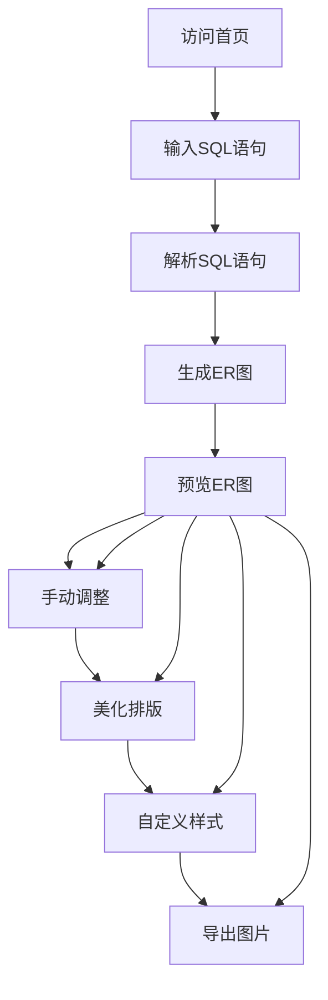

## 1. 产品概述
SQL转ER图在线生成工具，帮助开发者将SQL建表语句转换为专业的数据库ER图，提供可视化数据库设计功能。
- 主要目的是简化数据库设计流程，让开发者能够直观地理解和展示数据库结构。
- 目标用户为数据库开发者、软件工程师和数据分析师，市场价值在于提高数据库设计效率。

## 2. 核心功能

### 2.1 用户角色
| 角色 | 注册方法 | 核心权限 |
|------|---------------------|------------------|
| 普通用户 | 无需注册 | 可使用所有功能，包括SQL解析、ER图生成、导出等 |

### 2.2 功能模块
1. **首页**：SQL输入区、ER图预览区、功能操作区
2. **文档页**：使用指南、常见问题、功能说明

### 2.3 页面详情
| 页面名称 | 模块名称 | 功能描述 |
|-----------|-------------|---------------------|
| 首页 | SQL输入区 | 支持粘贴SQL建表语句、上传SQL文件、AI生成ER图、手动输入修改 |
| 首页 | ER图预览区 | 实时展示生成的ER图，支持节点拖拽、画布缩放、双击编辑文本 |
| 首页 | 功能操作区 | 提供美化排版、智能显示属性、修改样式、导出图片等功能 |
| 文档页 | 使用指南 | 详细说明工具使用方法、步骤和最佳实践 |
| 文档页 | 常见问题 | 解答用户使用过程中可能遇到的问题 |

## 3. 核心流程
用户使用流程：
1. 用户访问首页，在SQL输入区粘贴SQL建表语句或上传SQL文件
2. 系统解析SQL语句，生成ER图并在预览区展示
3. 用户可以手动调整ER图，包括拖拽节点、修改文本、添加关系等
4. 用户可以使用美化排版、智能显示属性等功能优化ER图
5. 用户可以自定义ER图样式，包括节点颜色、大小、布局等
6. 用户可以导出ER图为PNG、SVG、JPEG或Drawio格式

## 4. 用户界面设计
### 4.1 设计风格
- 主色调：蓝色系 (#165DFF)，辅助色：浅灰 (#F5F7FA)、深灰 (#4E5969)
- 按钮风格：圆角矩形，主按钮有轻微阴影
- 字体：主要使用系统默认无衬线字体，标题16-20px，正文14px，注释12px
- 布局风格：卡片式布局，清晰的功能分区，响应式设计
- 图标风格：简约线性图标，主要使用Lucide React图标库

### 4.2 页面设计概览
| 页面名称 | 模块名称 | UI元素 |
|-----------|-------------|-------------|
| 首页 | SQL输入区 | 多行文本输入框，上传按钮，AI生成按钮，解析按钮，语法高亮 |
| 首页 | ER图预览区 | 可缩放画布，可拖拽节点，关系连接线，双击编辑功能 |
| 首页 | 功能操作区 | 美化排版按钮，智能显示属性按钮，修改样式按钮，导出按钮 |
| 文档页 | 使用指南 | 步骤式说明，代码示例，图片展示 |
| 文档页 | 常见问题 | 折叠式问答，搜索功能 |

### 4.3 响应性
- 桌面优先设计，支持1024px以上分辨率
- 平板适配，支持768px-1023px分辨率
- 移动设备适配，支持360px-767px分辨率
- 触摸优化，支持移动设备的触摸操作

### 4.4 3D场景指导
- 无3D场景需求