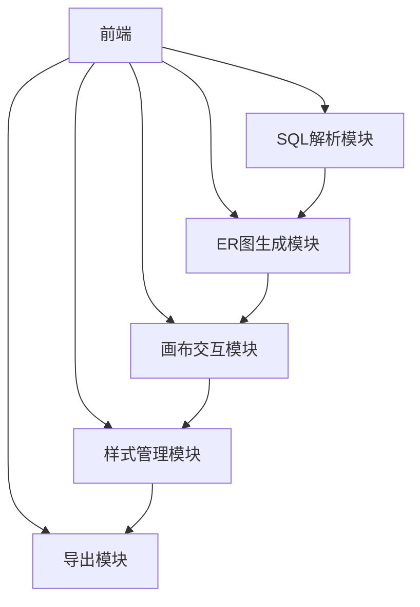
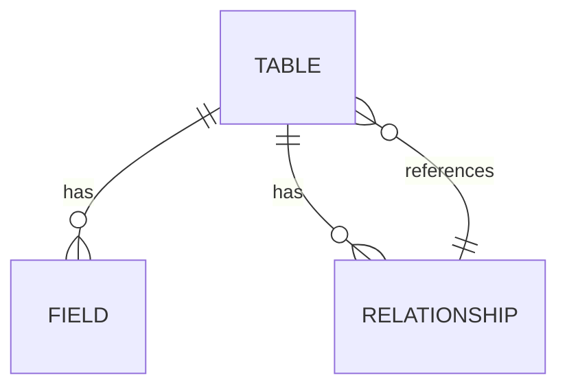

## 1. 架构设计

## 2. 技术描述
- 前端：React@18 + TypeScript + Tailwind CSS + Vite
- 初始化工具：Vite
- 后端：无（纯前端实现）
- 数据库：无
- 第三方库：
  - reactflow：用于ER图画布交互
  - monaco-editor：用于SQL代码编辑和语法高亮
  - file-saver：用于导出文件
  - lucide-react：用于图标

## 3. 路由定义
| 路由 | 目的 |
|-------|---------|
| / | 首页，包含SQL输入、ER图预览和功能操作 |
| /docs | 文档页，包含使用指南和常见问题 |

## 4. API定义
- 无后端API，所有功能均在前端实现

## 5. 服务器架构图
- 无后端服务器，纯前端应用

## 6. 数据模型
### 6.1 数据模型定义

### 6.2 数据定义
- Table：表结构
  - id: string
  - name: string
  - comment: string
  - fields: Field[]
  - relationships: Relationship[]

- Field：字段结构
  - id: string
  - name: string
  - type: string
  - isPrimaryKey: boolean
  - isNullable: boolean
  - defaultValue: string | null
  - comment: string

- Relationship：关系结构
  - id: string
  - sourceTable: string
  - sourceField: string
  - targetTable: string
  - targetField: string
  - type: 'one-to-one' | 'one-to-many' | 'many-to-many'

### 6.3 状态管理
- 使用Zustand进行状态管理，存储：
  - SQL输入文本
  - 解析后的表结构
  - ER图布局信息
  - 样式配置
  - 导出设置