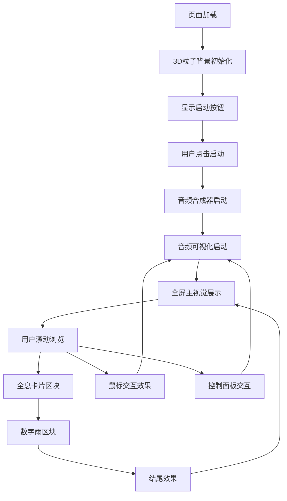

## 1. 产品概述
赛博狂欢风格的观赏性纯前端网页，融合3D粒子效果、音频可视化和故障艺术视觉。
- 为用户提供沉浸式的赛博朋克视觉体验，无需后端支持，打开即可观看。
- 目标用户为喜欢科技感、视觉艺术和电子音乐的前端爱好者和创意人士。

## 2. 核心功能

### 2.1 用户角色
| 角色 | 注册方式 | 核心权限 |
|------|----------|----------|
| 访客 | 无需注册 | 观看所有视觉效果、体验音频可视化、与页面交互 |

### 2.2 功能模块
1. **全屏加载与主视觉**：3D粒子背景、故障文字效果、扫描线动画
2. **音频可视化核心区**：合成器音效、环形频谱、粒子脉冲效果
3. **数据流与全息卡片**：磨砂玻璃卡片、悬浮动画、视差效果
4. **数字雨传送带**：Canvas数字雨、横向滚动标语
5. **结尾**：粒子消散与聚合、故障文字闪烁
6. **互动控制面板**：麦克风控制、音乐控制、视觉模式切换、数字雨开关、色彩主题切换、冻结/恢复

### 2.3 页面详情
| 页面名称 | 模块名称 | 功能描述 |
|----------|----------|----------|
| 主页面 | 全屏加载与主视觉 | 3D粒子环背景、中央大标题故障效果、副标题逐字浮现、底部频谱预视图、扫描线扫过效果 |
| 主页面 | 音频可视化核心区 | 立体声音频合成器、环形频谱可视化、粒子随节拍脉冲、麦克风混合选项、实时频率显示 |
| 主页面 | 数据流与全息卡片 | 三张磨砂玻璃卡片横向排列、卡片内小动画图标、鼠标悬停3D倾斜视差 |
| 主页面 | 数字雨传送带 | Canvas数字雨效果、横向滚动标语、半透明叠加 |
| 主页面 | 结尾 | 3D粒子消散与聚合、故障文字闪烁3次后稳定、粒子重新聚合形成循环 |
| 主页面 | 互动控制面板 | 麦克风开关、音乐控制组（播放/暂停、音量、BPM、节奏预设）、视觉模式切换、数字雨开关、色彩主题切换、冻结/恢复 |

## 3. 核心流程
用户打开页面 → 页面加载 → 显示启动按钮 → 用户点击启动 → 音频和视觉效果开始 → 用户可滚动浏览不同区块 → 鼠标移动产生交互效果 → 音频可视化实时响应 → 用户通过控制面板调整参数

## 4. 用户界面设计
### 4.1 设计风格
- 主色调：深空黑底 #000011
- 霓虹主色：电光紫 #c000ff、灼热粉 #ff00a0、亮蓝 #00f0ff、镭射绿 #39ff14
- 按钮风格：霓虹发光边框、脉冲效果
- 字体：科技感无衬线字体，大标题粗体
- 布局风格：全屏区块式，垂直滚动或自动切换
- 图标风格：几何线条、故障艺术效果

### 4.2 页面设计概览
| 页面名称 | 模块名称 | UI元素 |
|----------|----------|--------|
| 主页面 | 全屏加载与主视觉 | 3D粒子环背景、中央大标题（故障效果）、副标题（逐字浮现）、扫描线动画、底部频谱预视图 |
| 主页面 | 音频可视化核心区 | 环形频谱（Canvas/Three.js）、粒子随节拍脉冲、实时频率数字显示、麦克风状态提示 |
| 主页面 | 数据流与全息卡片 | 三张磨砂玻璃卡片（backdrop-filter: blur(20px)）、霓虹边框、卡片内小动画图标、鼠标悬停3D倾斜视差 |
| 主页面 | 数字雨传送带 | Canvas数字雨效果、半透明叠加、横向滚动标语 |
| 主页面 | 结尾 | 3D粒子消散与聚合、故障文字闪烁3次后稳定、最终标语显示 |
| 主页面 | 互动控制面板 | 右下角浮动控制面板、磨砂玻璃风格、霓虹边框、按钮带发光反馈、可折叠/展开、移动端适配为悬浮圆球 |

### 4.3 响应式设计
- 桌面优先设计，适配移动端
- 粒子数量根据屏幕宽度自动调整（桌面端5000个，移动端2000个）
- 触摸设备支持触摸移动产生视差效果

### 4.4 3D场景指导
- 环境：深空背景，黑色底色
- 光照：霓虹色调点光源，随音乐变化强度
- 相机：固定视角，轻微随鼠标移动
- 构图：中央聚焦，粒子环围绕中心
- 交互：鼠标移动产生引力扰动
- 后处理：轻微辉光效果
- 性能预算：粒子数量控制在5000以内，确保60fps