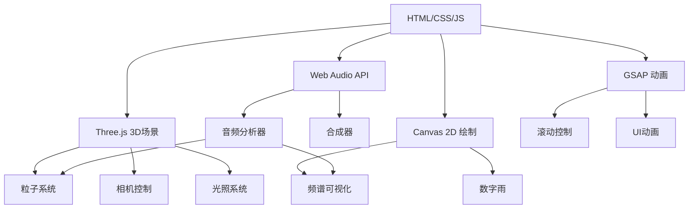

## 1. 架构设计


## 2. 技术描述
- 前端：纯HTML5 + CSS3 + JavaScript
- 3D引擎：Three.js@0.160.0
- 动画库：GSAP@3.12.5
- 音频处理：Web Audio API
- 2D绘制：Canvas 2D API
- 外部依赖：通过CDN引入Three.js和GSAP

## 3. 路由定义
| 路由 | 用途 |
|------|------|
| / | 主页面，包含所有视觉效果和交互 |

## 4. 核心技术实现

### 4.1 Three.js 3D场景
- 粒子系统：使用Points或BufferGeometry创建粒子环
- 相机：PerspectiveCamera，固定位置，轻微随鼠标移动
- 光照：PointLight，颜色随音乐变化
- 材质：PointsMaterial，使用AdditiveBlending实现发光效果

### 4.2 Web Audio API
- 合成器：使用OscillatorNode创建低频贝斯和高频镲音
- LFO：使用OscillatorNode创建低频振荡器控制音量
- 音频分析：使用AnalyserNode获取频谱数据
- 麦克风集成：使用getUserMedia获取用户麦克风输入

### 4.3 Canvas 2D 绘制
- 数字雨：使用requestAnimationFrame绘制下落的字符
- 频谱可视化：绘制环形频谱柱状图
- 性能优化：使用离屏Canvas减少重绘

### 4.4 GSAP 动画
- 滚动控制：使用ScrollTrigger控制区块切换
- UI动画：实现故障文字效果、扫描线动画
- 时间线：创建自动推进的时间线

## 5. 性能优化策略
- 粒子数量控制：桌面端5000个，移动端2000个
- 渲染优化：使用BufferGeometry减少 draw call
- 音频处理：使用ScriptProcessorNode处理音频数据
- 动画优化：优先使用CSS transform和opacity

## 6. 兼容性处理
- 自动播放策略：在用户首次交互时恢复AudioContext
- 降级处理：在不支持Web Audio API的浏览器中使用静态视觉效果
- 响应式设计：根据屏幕尺寸调整粒子数量和布局

## 7. 代码结构
```
├── index.html          # 主HTML文件
│   ├── <head>          # CSS样式和CDN引入
│   └── <body>          # 页面结构
│       ├── #canvas3d   # Three.js 3D场景容器
│       ├── #canvas2d   # Canvas 2D 绘制容器
│       ├── #ui         # UI元素容器
│       └── #start-btn  # 启动按钮（降级处理）
├── <style>             # 内联CSS样式
└── <script>            # 内联JavaScript代码
    ├── initScene()     # 初始化3D场景
    ├── initAudio()     # 初始化音频系统
    ├── initCanvas()    # 初始化Canvas 2D
    ├── initUI()        # 初始化UI元素
    ├── animate()       # 主动画循环
    └── handleInteraction()  # 处理用户交互
```

## 8. 关键技术点
- 音频可视化：将AnalyserNode的频谱数据映射到粒子大小、颜色和位置
- 故障艺术效果：使用CSS animation和clip-path实现RGB通道分离
- 数字雨：使用Canvas 2D绘制随机下落的霓虹字符
- 粒子系统：使用Three.js创建动态粒子环，随音乐脉动
- 响应式设计：根据屏幕尺寸自动调整粒子数量和布局